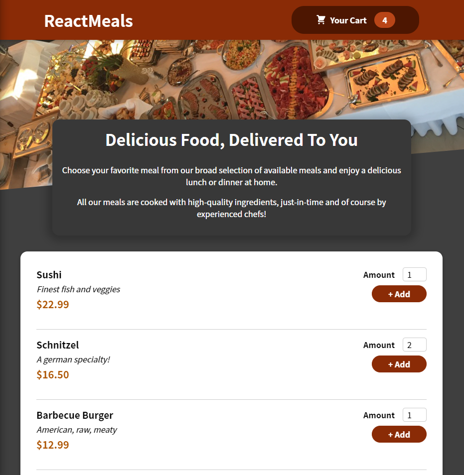

# React Meals



## Usage

Clone it :

```
$ git clone https://github.com/Dibyaranjan450/React-Meals.git
```

Visit the page at : 

```
https://dibyaranjan450.github.io/React-Meals/
```

## Contributor

- Creator of React-Meals [@Dibyaranjan450](https://github.com/Dibyaranjan450)
